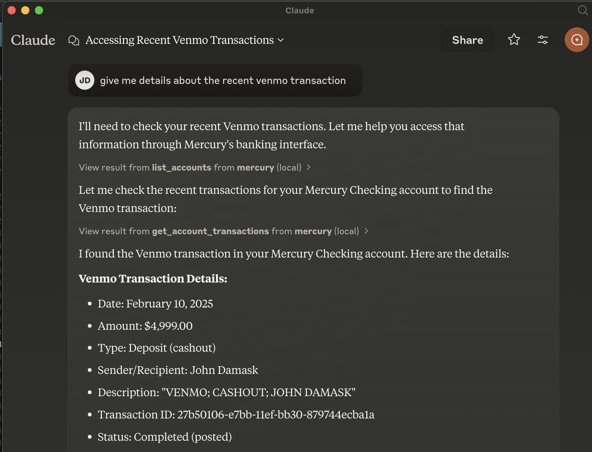

# Mercury MCP Server

Python MCP (Model Control Protocol) server that provides access to Mercury bank accounts through the Mercury API. It's currently READ ONLY



## Clients

Any client that supports MCP should work but this has only been tested with Claude Desktop.

## Setup

1. Clone this repository
2. Create new virtual environment, activate it and install dependencies:
   ```
   python3 -m venv .venv && source .venv/bin/activate
   pip install -r requirements.txt
   ```
3. Create a `.env` file in the root directory with your Mercury API key:
   ```
   MERCURY_API_KEY=your_mercury_api_key_here
   ```
   You can obtain an API key from the Mercury developer dashboard.

## Usage

### Install on Claude Desktop

Edit ~/Library/Application\ Support/Claude/claude_desktop_config.json and add the MCP server

```
{
  "mcpServers": {
    "mercury": {
      "command": "<fully qualified path>/uv",
      "args": [
        "run",
        "--with",
        "mcp[cli]",
        "mcp",
        "run",
        "<fully qualified path>/mcp-mercury.py"
      ]
    }
  }
}
```

## Security Note

This server requires your Mercury API key which has access to sensitive financial information. Never share your API key or commit it to version control.
